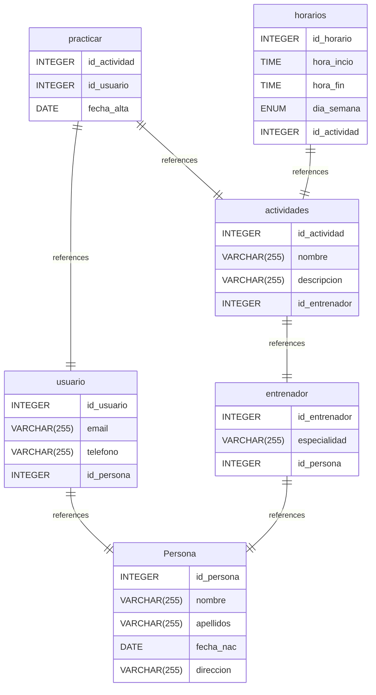

# Untitled Diagram documentation
## Summary

- [Introduction](#introduction)
- [Database Type](#database-type)
- [Table Structure](#table-structure)
	- [Persona](#Persona)
	- [usuario](#usuario)
	- [entrenador](#entrenador)
	- [actividades](#actividades)
	- [practicar](#practicar)
	- [horarios](#horarios)
- [Relationships](#relationships)
- [Database Diagram](#database-Diagram)

## Introduction

## Database type

- **Database system:** MySQL
## Table structure

### Persona

| Name        | Type          | Settings                      | References                    | Note                           |
|-------------|---------------|-------------------------------|-------------------------------|--------------------------------|
| **id_persona** | INTEGER | 🔑 PK, not null , unique, autoincrement |  | |
| **nombre** | VARCHAR(255) | not null  |  | |
| **apellidos** | VARCHAR(255) | not null  |  | |
| **fecha_nac** | DATE | not null  |  | |
| **direccion** | VARCHAR(255) | not null  |  | | 

### usuario

| Name        | Type          | Settings                      | References                    | Note                           |
|-------------|---------------|-------------------------------|-------------------------------|--------------------------------|
| **id_usuario** | INTEGER | 🔑 PK, not null , unique, autoincrement |  | |
| **email** | VARCHAR(255) | not null  |  | |
| **telefono** | VARCHAR(255) | not null  |  | |
| **id_persona** | INTEGER | not null  | fk_usuario_id_persona_Persona | | 

### entrenador

| Name        | Type          | Settings                      | References                    | Note                           |
|-------------|---------------|-------------------------------|-------------------------------|--------------------------------|
| **id_entrenador** | INTEGER | 🔑 PK, not null , unique, autoincrement |  | |
| **especialidad** | VARCHAR(255) | not null  |  | |
| **id_persona** | INTEGER | not null  | fk_entrenador_id_persona_Persona | | 

### actividades

| Name        | Type          | Settings                      | References                    | Note                           |
|-------------|---------------|-------------------------------|-------------------------------|--------------------------------|
| **id_actividad** | INTEGER | 🔑 PK, not null , unique, autoincrement |  | |
| **nombre** | VARCHAR(255) | not null  |  | |
| **descripcion** | VARCHAR(255) | not null  |  | |
| **id_entrenador** | INTEGER | not null  | fk_actividades_id_entrenador_entrenador | | 

### practicar

| Name        | Type          | Settings                      | References                    | Note                           |
|-------------|---------------|-------------------------------|-------------------------------|--------------------------------|
| **id_actividad** | INTEGER | 🔑 PK, not null , unique, autoincrement | fk_practicar_id_actividad_actividades | |
| **id_usuario** | INTEGER | 🔑 PK, not null  | fk_practicar_id_usuario_usuario | |
| **fecha_alta** | DATE | not null  |  | | 

### horarios

| Name        | Type          | Settings                      | References                    | Note                           |
|-------------|---------------|-------------------------------|-------------------------------|--------------------------------|
| **id_horario** | INTEGER | 🔑 PK, not null , unique, autoincrement |  | |
| **hora_incio** | TIME | not null  |  | |
| **hora_fin** | TIME | not null  |  | |
| **dia_semana** | ENUM | not null  |  | |
| **id_actividad** | INTEGER | not null  | fk_horarios_id_actividad_actividades | | 

#### Enums
##### dia_semana

- 'lunes'
- 'martes'
- 'miercoles'
- 'jueves'
- 'viernes'
- 'sabado'
- 'domingo'

## Relationships

- **usuario to Persona**: one_to_one
- **entrenador to Persona**: one_to_one
- **actividades to entrenador**: one_to_one
- **practicar to actividades**: one_to_one
- **practicar to usuario**: one_to_one
- **horarios to actividades**: one_to_one

## Database Diagram

